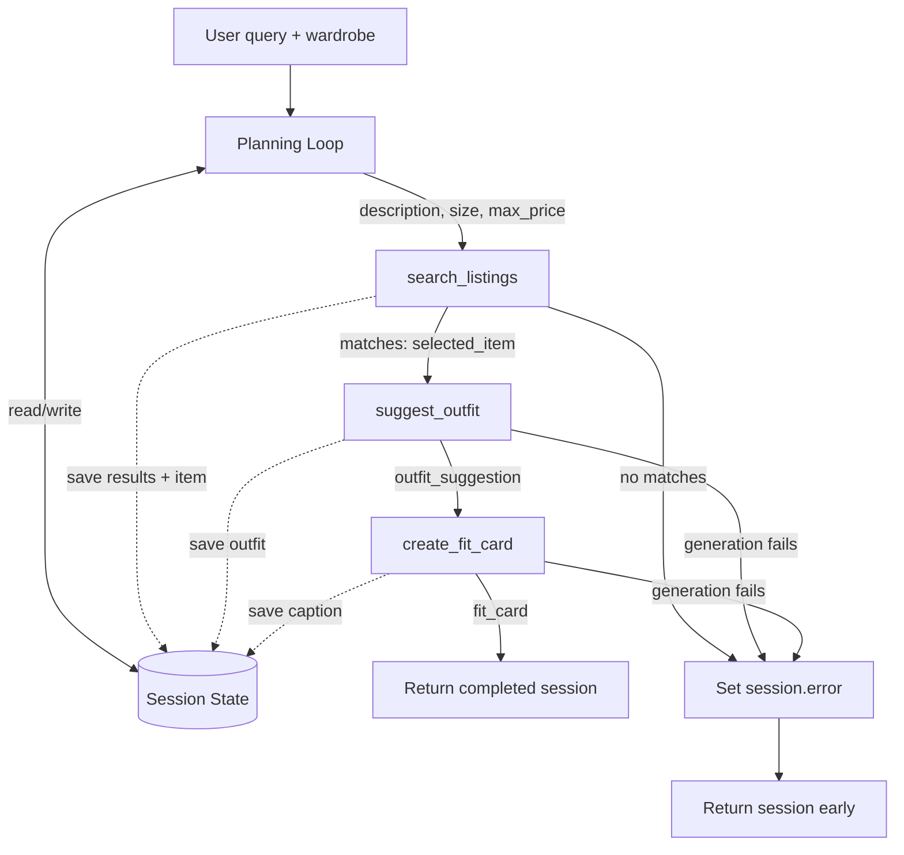

# FitFindr — planning.md

> Complete this document before writing any implementation code.
> Your spec and agent diagram are what you'll use to direct AI tools (Claude, Copilot, etc.) to generate your implementation — the more specific they are, the more useful the generated code will be.
> Your planning.md will be reviewed as part of your submission.
> Update it before starting any stretch features.

---

## Tools

List every tool your agent will use. For each tool, fill in all four fields.
You must have at least 3 tools. The three required tools are listed — add any additional tools below them.

### Tool 1: search_listings

**What it does:**
Loads the mock marketplace data with `load_listings()`, applies the user's optional size and price constraints, and scores the remaining listings by case-insensitive keyword overlap between the requested description and each listing's searchable fields (`title`, `description`, `category`, `style_tags`, `colors`, `brand`, and `platform`). It removes zero-score items and returns matches in descending relevance order so the planning loop can select the first item.

**Input parameters:**

- `description` (`str`): Required search text describing the desired piece or style, such as `"vintage graphic tee"`; after normalization, its keywords are used for relevance scoring.
- `size` (`str | None`, default `None`): Optional requested size, such as `"M"` or `"US 8"`. Matching is case-insensitive against the listing's `size` string, so `"M"` can match a combined size such as `"S/M"`; `None` disables this filter.
- `max_price` (`float | None`, default `None`): Optional inclusive price ceiling in dollars. A listing is retained when `listing["price"] <= max_price`; `None` disables this filter.

**What it returns:**
A `list[dict]` containing zero or more complete listing records, sorted from highest to lowest keyword-overlap score. Every dictionary contains `id` (`str`), `title` (`str`), `description` (`str`), `category` (`str`), `style_tags` (`list[str]`), `size` (`str`), `condition` (`str`), `price` (`float`), `colors` (`list[str]`), `brand` (`str | None`), and `platform` (`str`); the internal relevance score is used only for sorting and is not added to the returned record.

**What happens if it fails or returns nothing:**
An ordinary no-match returns `[]`. The agent sets `session["error"]` to `"No listings matched 'DESCRIPTION' in size SIZE under $PRICE. Try a broader description, another size, or a higher price limit."` (omitting constraints that were not supplied), leaves `selected_item`, `outfit_suggestion`, and `fit_card` as `None`, and returns the session immediately without calling either later tool. If loading or searching raises an exception, the agent instead sets `"I couldn't search the listings right now. Please try again."` and returns early.

---

### Tool 2: suggest_outfit

**What it does:**
Uses the selected marketplace listing and the user's wardrobe to generate one or two wearable combinations. When wardrobe items exist, it names specific pieces from that wardrobe; when the wardrobe is empty, it generates general advice describing the types of bottoms, shoes, layers, or accessories that would work.

**Input parameters:**

- `new_item` (`dict`): The complete listing dictionary selected from `search_listings`, including all listing fields (`id`, `title`, `description`, `category`, `style_tags`, `size`, `condition`, `price`, `colors`, `brand`, and `platform`).
- `wardrobe` (`dict`): A dictionary with an `items` key containing `list[dict]`. Each wardrobe item has `id` (`str`), `name` (`str`), `category` (`str`), `colors` (`list[str]`), `style_tags` (`list[str]`), and optional `notes` (`str | None`).

**What it returns:**
A non-empty `str` containing one or two concise outfit suggestions. With a populated wardrobe it identifies the exact wardrobe pieces by name, explains why they complement `new_item`, and may include a styling detail such as layering, cuffing, or a partial tuck; with an empty wardrobe it labels the result as general styling and uses hypothetical language instead of inventing owned pieces. If the first empty-wardrobe response implies ownership, the tool requests one rewrite and rejects a second invalid response.

**What happens if it fails or returns nothing:**
An empty `wardrobe["items"]` is a supported fallback: the tool returns general styling advice and the planning loop continues. If `new_item` is missing/malformed, the LLM call raises an exception, or the returned text is empty/whitespace, the agent sets `session["error"]` to `"I found a listing, but couldn't create an outfit suggestion. Try again, or add a few wardrobe pieces with colors and categories."`, leaves `fit_card` as `None`, and returns early without calling `create_fit_card`.

---

### Tool 3: create_fit_card

**What it does:**
Turns the outfit suggestion and selected thrift listing into a casual, shareable OOTD caption. The caption naturally includes the listing title, price, and platform once and conveys the specific outfit's vibe rather than reading like a product description.

**Input parameters:**

- `outfit` (`str`): The non-empty outfit suggestion returned by `suggest_outfit`; it supplies the named pieces, styling instructions, and aesthetic to summarize.
- `new_item` (`dict`): The same complete listing dictionary stored in `session["selected_item"]`; at minimum the caption requires valid `title`, `price`, and `platform` values.

**What it returns:**
A non-empty, two-to-four-sentence `str` suitable for an Instagram or TikTok caption. It has a casual voice, mentions the item title, dollar price, and platform once each, and describes the outfit vibe; it may include restrained emoji or social phrasing but does not return metadata or a dictionary. When the outfit is labeled as general empty-wardrobe styling, the caption uses hypothetical wording such as “I'd style it with” and never claims the user owns or wore the suggested supporting pieces.

**What happens if it fails or returns nothing:**
The function guards against an empty/whitespace `outfit` or missing required item fields and returns `"Error: Cannot create fit card without a complete outfit, title, price, and platform."` rather than calling the LLM. The planning loop recognizes the exact `"Error:"` prefix (or catches an API exception/empty LLM response), sets `session["error"]` to `"Your outfit idea is ready, but I couldn't create the fit card because the outfit or listing details were incomplete. You can still use the outfit suggestion above, or try generating the card again."`, leaves `fit_card` as `None`, and returns the session while preserving the listing and outfit suggestion.

---

### Additional Tools (if any)

None. Query parsing and session orchestration are planning-loop responsibilities, not separately exposed tools.

---

## Planning Loop

**How does your agent decide which tool to call next?**

1. Call `_new_session(query, wardrobe)`. If `query.strip()` is empty, set `session["error"] = "Tell me what item you're looking for—for example, 'vintage graphic tee under $30, size M'."` and return immediately.
2. Parse the query deterministically. Use the first shopping-request clause as the search clause, excluding later preference/styling clauses such as `I mostly wear...` and `how would I style it?`. Extract `max_price` from a case-insensitive `under`, `below`, `less than`, or `max` phrase followed by an optional `$` and a number; extract `size` from `size VALUE` (or recognizable apparel/shoe size language); remove those constraint phrases and filler such as `I'm looking for` from the search clause to form `description`. Store exactly `{"description": str, "size": str | None, "max_price": float | None}` in `session["parsed"]`. If the remaining description is empty, set a message asking for an item description and return.
3. Call `search_listings(**session["parsed"])` inside `try/except` and store its list in `session["search_results"]`. If an exception occurs, set the search-service error described above and return. If the list is empty, set the actionable no-results message and return; neither `suggest_outfit` nor `create_fit_card` may run on this branch.
4. If results exist, assign `session["selected_item"] = session["search_results"][0]`. Call `suggest_outfit(session["selected_item"], session["wardrobe"])` inside `try/except`. If its result is not a non-empty string, or the call raises, set the outfit error message and return; otherwise store the stripped string in `session["outfit_suggestion"]`.
5. Call `create_fit_card(session["outfit_suggestion"], session["selected_item"])` inside `try/except`. If it raises, returns empty/whitespace, or returns a string beginning with `"Error:"`, set the fit-card error message and return while retaining the earlier successful fields. Otherwise store the stripped caption in `session["fit_card"]`.
6. The loop is complete when either an error branch returns early or all three output fields (`selected_item`, `outfit_suggestion`, and `fit_card`) are populated. On success, leave `session["error"]` as `None` and return the full session.

---

## State Management

**How does information from one tool get passed to the next?**
One session dictionary is the source of truth for a single request. It contains `query`, `parsed`, `search_results`, `selected_item`, `wardrobe`, `outfit_suggestion`, `fit_card`, and `error`; a new session is created per call so users do not share state. `parsed` is unpacked into `search_listings`; the first element of `search_results` becomes `selected_item`; `selected_item` plus `wardrobe` are passed to `suggest_outfit`; and its saved `outfit_suggestion` plus the same `selected_item` are passed to `create_fit_card`. Each value is written only after its tool succeeds, and `error` explains the first terminating failure, so downstream tools never receive absent upstream data.

---

## Error Handling

For each tool, describe the specific failure mode you're handling and what the agent does in response.

| Tool | Failure mode | Agent response |
|------|-------------|----------------|
| search_listings | No results match the query | Set `session["error"]` to `"No listings matched 'vintage graphic tee' in size M under $30. Try a broader description, another size, or a higher price limit."` Return immediately and do not call the other tools. |
| suggest_outfit | Wardrobe is empty | Continue normally with general advice, explicitly saying which types of bottoms, shoes, and layers would pair with the item; do not claim the user owns them. If the generation itself fails, say `"I found a listing, but couldn't create an outfit suggestion. Try again, or add a few wardrobe pieces with colors and categories."` and stop before fit-card generation. |
| create_fit_card | Outfit input is missing or incomplete | Preserve the listing and any valid outfit suggestion, set `session["error"]` to `"Your outfit idea is ready, but I couldn't create the fit card because the outfit or listing details were incomplete. You can still use the outfit suggestion above, or try generating the card again."`, and do not display a fabricated caption. |

---

## Architecture

---

## AI Tool Plan

**Milestone 3 — Individual tool implementations:**

I will use ChatGPT separately for each function. For `search_listings`, I will provide the complete **Tool 1** block, the listing field contract from **State Management**, and the `load_listings()` signature from `utils/data_loader.py`; I will ask for a typed implementation that applies inclusive price filtering, case-insensitive size matching, keyword scoring across the documented fields, zero-score removal, and relevance sorting without mutating records. Before accepting it, I will inspect those conditions and run at least three assertions: a normal multi-result query, a query with size/price constraints, and a deliberate no-result query.

For `suggest_outfit`, I will provide the complete **Tool 2** block, the wardrobe item schema, and its row from **Error Handling**. I will ask ChatGPT to implement the populated-wardrobe and empty-wardrobe prompt branches using `_get_groq_client()`, returning a non-empty string in both supported cases. I will test it with `get_example_wardrobe()` and `get_empty_wardrobe()`, verify named pieces actually exist in the example wardrobe, and simulate a missing API key/empty model response to confirm the caller can handle failure.

For `create_fit_card`, I will provide the complete **Tool 3** block, its failure row, and one valid listing/outfit pair from **A Complete Interaction**. I will ask for input guards and a Groq prompt that produces two to four casual sentences mentioning title, price, and platform once. I will inspect the generated guard before running it, then test valid input, whitespace-only outfit input, and a listing missing a required field; for valid output I will manually verify length, tone, and required facts.

**Milestone 4 — Planning loop and state management:**

I will give ChatGPT the entire **Planning Loop**, **State Management**, and **Error Handling** sections plus the Mermaid diagram in **Architecture**, along with the existing `_new_session()` and `run_agent()` stubs. I will ask it to implement deterministic query parsing and the exact success/early-return branches while preserving the current session keys. Before using the code, I will trace every diagram arrow against the implementation, confirm no downstream call is possible after an empty search or failed outfit, and run happy-path, no-results, empty-wardrobe, empty-query, and mocked tool-failure tests; I will also assert that success returns `error is None` and each failure preserves completed state while leaving later fields `None`.

---

## A Complete Interaction (Step by Step)

Write out what a full user interaction looks like from start to finish — tool call by tool call. Use a specific example query.

FitFindr first calls `search_listings` when the user describes an item they want, filtering the marketplace listings by details such as the query, size, and maximum price, then selects the most relevant result. When a listing is found, it calls `suggest_outfit` with that item and the user's wardrobe, and then calls `create_fit_card` with the resulting outfit and new item to produce a shareable caption. If the search finds no listings, FitFindr suggests ways to broaden or change the search and stops; likewise, a later tool failure is explained to the user instead of passing missing or invalid output to the next tool.

**Example user query:** "I'm looking for a vintage graphic tee under $30, size M. I mostly wear baggy jeans and chunky sneakers. What's out there and how would I style it?"

**Step 1:**
The planning loop parses the query into `{"description": "vintage graphic tee", "size": "M", "max_price": 30.0}` and stores it in `session["parsed"]`. It calls `search_listings(description="vintage graphic tee", size="M", max_price=30.0)`, which returns three complete listing dictionaries sorted by relevance; the top record is `{"title": "Faded Band Tee", "price": 22.0, "platform": "depop", "condition": "good", ...}`. The agent saves the list in `session["search_results"]` and that first dictionary in `session["selected_item"]`.

**Step 2:**
Because `search_results` is not empty, the agent calls `suggest_outfit(new_item=session["selected_item"], wardrobe=get_example_wardrobe())`. It returns `"Pair this with your baggy straight-leg dark-wash jeans and chunky white sneakers for a classic 90s grunge look. Roll the sleeves once and tuck the front corner slightly for shape."`, which is stored in `session["outfit_suggestion"]`.

**Step 3:**
Because the outfit string is non-empty, the agent calls `create_fit_card(outfit=session["outfit_suggestion"], new_item=session["selected_item"])`. It returns `"Thrifted this Faded Band Tee off Depop for $22, and honestly it was made for my baggy jeans and chunky sneakers 🖤 Full look in my stories."`; the agent stores this in `session["fit_card"]`, leaves `session["error"] = None`, and returns the completed session.

**Final output to user:**
The UI shows the selected listing (`Faded Band Tee — $22 — Depop — good condition`), the named outfit suggestion using the user's baggy jeans and chunky sneakers, and the generated fit-card caption. If Step 1 had returned `[]`, the user would instead see the actionable no-results message in the listing panel and blank outfit/fit-card panels because Steps 2 and 3 would not run.
